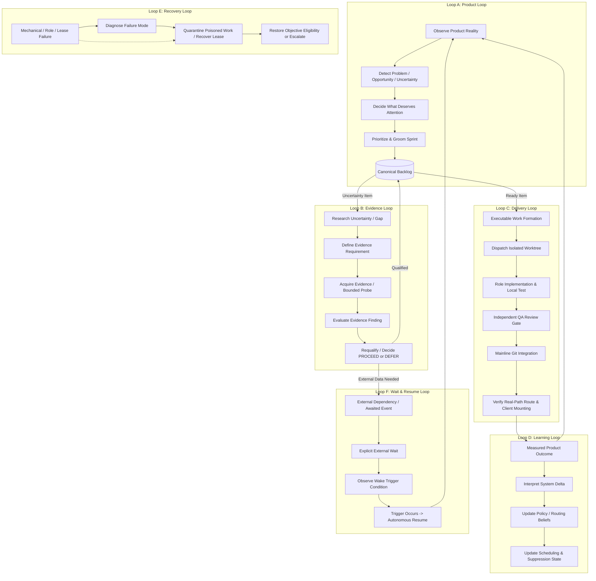

# AI COMPANY — PRODUCT OPERATING SYSTEM SPECIFICATION
**Version:** 1.0.0-PROD-OS  
**Status:** CANONICAL ARCHITECTURE CONTRACT  
**Authority:** Autonomous Product Company Governance  
**Target Platform:** Macro OS (`server/`, `src/app/`, `docs/PRODUCT_GOAL.md`)  

---

## 1. Mission

The AI Company is an autonomous product operating system responsible for delivering, maintaining, and improving **Macro OS** as the shared macroeconomic research and intelligence platform for institutional analysts, economists, and sovereign researchers.

The core mission is:
> **To operate as a closed autonomous product operating system that continuously traverses the product lifecycle—from observing macro product reality to acquiring evidence, qualifying needs, forming work, executing, reviewing, integrating, and learning—delivering verified product value without requiring routine human founder intervention.**

---

## 2. Delegated Company Responsibility vs. Founder Responsibility

### 2.1 Delegated Company Authority (Autonomous Scope)
The company holds full delegated operational authority to execute within the frozen control boundary:
1. **Product Observation & Discovery:** Continuously observe Macro OS runtime routes, data planes, indicator hydration, and user workflows; detect defects, data-staleness gaps, unconsumed modules, and frontier opportunities.
2. **Evidence Need Identification & Acquisition:** Formulate empirical research hypotheses, identify missing data or contracts, execute bounded database probes, and gather source telemetry.
3. **Qualification & Prioritization:** Score opportunities using evidence quality, goal coverage, and risk; maintain the qualified work runway; kill ungrounded or speculative tasks.
4. **Autonomous Sprint Formation:** Groom opportunities into concrete backlog items with strict allowed path boundaries and test assertions.
5. **Role Dispatch & Work Execution:** Dispatch role-specialized agents (`pm`, `backend-engineer`, `functional-qa`, `data-qc`, `domain-expert`, `ux-research`) into isolated git worktrees.
6. **Quality Review & Pre-Release Gates:** Enforce fail-closed Vitest test execution, fact/inference boundary checks, unversioned route parity, and code contract validation.
7. **Mainline Integration:** Commit verified worktree deltas directly to the active engineering branch (`codex/ai-company-hardening-20260910`).
8. **Real-Path Consumption Enforcement:** Refuse delivery claims if code is not mounted into authoritative Express routers or consumed by active client journeys.
9. **Learning Feedback:** Project outcomes into downstream decisions; update routing policies, suppress duplicate failures, and record verified empirical progress.
10. **Recovery & Zero-Cognition Waiting:** Reconcile orphaned leases, quarantine poisoned work, and execute low-cost polling when awaiting verifiable external events.

### 2.2 Founder Authority (Reserved Scope)
The Founder reserves exclusive authority for:
1. **Capital, Runway, & Financial Commitments:** Adding paid data providers or authorizing external cloud billing.
2. **Production Release Gates:** Promoting code from local/staging runtime to production live environments (`HUMAN_GATED / NO_GO`).
3. **Legal & Licensing Agreements:** Modifying commercial redistribution licenses, terms of service, or user agreements.
4. **Product Goal & Constitution Amendments:** Changing the core mission, target personas, or governance invariants defined in `docs/PRODUCT_GOAL.md`.
5. **Emergency Manual Override:** Halting the marathon (`MARATHON_STOPPED_BY_FOUNDER`) or revoking execution leases.

### 2.3 Non-Delegable Prohibition (Anti-Founder-Fallback Law)
**The company is strictly prohibited from routing routine product ambiguities, candidate selections, or backlog grooming decisions to the Founder.**
If the company halts because it requires a human to pick between Option A, Option B, or Option C, it is classified as a **`FOUNDER_FALLBACK` P0 Lifecycle Defect**.

---

## 3. External Reality Boundaries

The company operates against an external physical and digital environment with explicit fairness assumptions:
1. **Provider Data Planes:** External data sources (FRED, St. Louis Fed, World Bank, SBV, PBOC) publish on discrete calendars. If data has not yet been published or ingested, the company cannot conjure it.
2. **Provider API Quotas:** External AI providers (`gemini`, `openai`, `anthropic`, `openrouter`) enforce rate limits (HTTP 429). The company must respect backoff windows without terminating.
3. **Execution Runtime:** Local execution occurs under macOS with POSIX semantics, git worktrees, SQLite persistence, and launchd process supervision.
4. **Observer Invariant:** Measuring or observing product reality must not alter the canonical data plane or produce synthetic observations.

---

## 4. Product Operating System: The Six Interacting Loops

The company operates not as a linear pipeline, but as six closed, interacting cybernetic loops:



### Loop A: Product Loop (Strategic Focus)
- **Inputs:** Macro OS route inventory, unhydrated indicators, quarantined sources, user journeys.
- **Transform:** `evaluateSearchLenses()` and `discoverOpportunities()`.
- **Exit Criteria:** A prioritized opportunity exists in the canonical backlog with clear acceptance criteria and allowed path boundaries.

### Loop B: Evidence Loop (Truth Grounding)
- **Inputs:** Research questions, held candidates, evidence gaps.
- **Transform:** Bounded database queries (`QUERY_EXISTING_DATA`), schema contract inspection, provider calendar verification.
- **Exit Criteria:** Evidence finding recorded with factual count; candidate transitions to `QUALIFIED`, `DEFERRED`, or `HELD_EXTERNAL_WAIT`.

### Loop C: Delivery Loop (Value Realization)
- **Inputs:** Backlog item with status `READY` or `SPRINT_SELECTED`.
- **Transform:** Sequential role dispatch (`pm` -> `backend-engineer` -> `functional-qa`) in disposable worktrees.
- **Exit Criteria:** Code merged to main branch, passing 100% of independent assertions, with real runtime callers verified.

### Loop D: Learning Loop (Adaptive Intelligence)
- **Inputs:** Execution results, test verdicts, telemetry records.
- **Transform:** Update `CANONICAL_PRODUCT_BACKLOG`, `QUALIFIED_WORK_RUNWAY`, and `scheduler-decisions`.
- **Exit Criteria:** Next cycle's routing reflects prior outcome; no duplicate attempts on identical failures.

### Loop E: Recovery Loop (Self-Healing Resilience)
- **Inputs:** Orphaned PID, broken lease, corrupted ledger line, failed admission.
- **Transform:** Orphan reconciliation, stale lease recovery, boundary regex parser repairs.
- **Exit Criteria:** Blocked work safely quarantined, admission locks cleared, marathon restored to executable state.

### Loop F: Wait & Resume Loop (Disciplined Patience)
- **Inputs:** External delay (provider quota reset, database hydration, scheduled calendar date).
- **Transform:** Deterministic fingerprint check, zero-cognition sleep, exponential backoff.
- **Exit Criteria:** Observable condition met -> marathon re-enters Step 1 Reconcile immediately.

---

## 5. State Semantics & Disposition Law

### 5.1 The Five Legitimate Dispositions
Every reachable non-terminal state in the Product OS must terminate in one of five legitimate dispositions:

```
[ANY REACHABLE STATE]
       │
       ├──> 1. PROGRESS (Material forward delta in product, evidence, or decision)
       ├──> 2. EVIDENCE_ACQUISITION (Bounded query or research resolving uncertainty)
       ├──> 3. EXPLICIT_EXTERNAL_WAIT (Awaiting observable external event with known producer)
       ├──> 4. HUMAN_AUTHORITY_ESCALATION (Genuinely reserved Founder authority action)
       └──> 5. TRUE_TERMINAL_STATE (Permanently DELIVERED, REJECTED, or KILLED)
```

### 5.2 The Four P0 Lifecycle Defects
Any state transition resulting in the following is a critical system violation:
1. **`ORPHAN_STATE`**: A state with zero legitimate outgoing transitions.
2. **`ZERO_DELTA_CYCLE`**: A cycle that executes actions, consumes tokens, or increments counters without changing material product, evidence, decision, or authority state.
3. **`FAKE_WAIT`**: A wait state without an explicit awaited event, observable trigger condition, or identified external producer (e.g. "wait forever because candidate pool is empty").
4. **`FOUNDER_FALLBACK`**: Aborting or pausing autonomous execution to ask the Founder to perform routine product management, selection, or grooming.

---

## 6. Progress & Witness Semantics

Progress is strictly defined by material state deltas, verified by a **Progress Witness**:

| State Delta Class | Progress Witness Definition | Required Evidence |
|---|---|---|
| `PRODUCT_CODE_MUTATION` | Production code changed, tested, and merged | Git commit SHA on mainline branch |
| `RUNTIME_CONSUMPTION` | Route mounted and consumed by callers | Express router registration + test assertion |
| `EVIDENCE_RESOLVED` | Uncertainty gap verified against factual data | Row count / observation provenance |
| `QUALIFICATION_TRANSITION` | Candidate evaluated against product criteria | PM decision record in canonical backlog |
| `PRIORITY_REBALANCED` | Sprint backlog formed or reprioritized | Updated `CANONICAL_PRODUCT_BACKLOG.json` |
| `DEFECT_QUARANTINED` | Poisoned or failing work isolated safely | Queue state transition to `QUARANTINED` |
| `EXTERNAL_WAIT_COMMITTED` | Formal wait contract registered | Hold contract with trigger & producer |
| `LEARNING_APPLIED` | Downstream routing changed based on past run | Scheduler decision delta / suppression update |

*Anti-Pattern Rule:* Cycle increments, log entries, token expenditures, and Markdown report writes do **not** constitute progress witnesses.

---

## 7. Wait Contract: Rigorous Justification Standard

No state may be classified as `COMPANY_JUSTIFIED_WAIT` or `EXPLICIT_EXTERNAL_WAIT` unless it satisfies the full **Wait Contract**:
1. **`wait_reason`**: Concrete explanation of what is missing.
2. **`awaited_event`**: Discrete physical or digital event that will break the wait.
3. **`trigger_type`**: `PROVIDER_DATA_INGESTION`, `QUOTA_RESET_WINDOW`, `CALENDAR_RELEASE_DATE`, or `FOUNDER_RESERVED_APPROVAL`.
4. **`trigger_producer`**: Specific external entity responsible for the event (e.g. `FRED_API`, `ST_LOUIS_FED`, `GEMINI_BACKOFF_TIMER`).
5. **`trigger_observer`**: Automated polling script or sensor checking the condition.
6. **`observable_condition`**: Deterministic boolean predicate (e.g. `new_observations_count > 0` or `Date.now() >= reset_at`).
7. **`resume_transition`**: State to which the system will transition upon observation.
8. **`expected_cost`**: Zero AI tokens during wait (pure sleep or low-cost SQLite query).
9. **`expiry_policy`**: Maximum wait time before escalating or permanently killing the candidate.

**If any field is missing, the wait is invalid (`FAKE_WAIT`).**

---

## 8. Quarantine, Hold, & Defer Semantics

| Status | Type | Owner | Change Trigger | Resume Transition |
|---|---|---|---|---|
| `QUARANTINED` | Temporary Internal / Terminal | Recovery Loop | Quarantine TTL expiry (60s) or manual purge | `CANDIDATE_REELIGIBLE` or `PERMANENTLY_EXCLUDED` |
| `HELD` | External Wait | Evidence Loop | External data plane hydration | `EVIDENCE_ACQUISITION` -> `QUALIFIED` |
| `DEFERRED` | Strategic Hold (H2) | Product Loop | Product roadmap epoch advance | `DISCOVERY_REASSESSMENT` |
| `RESEARCH_REQUIRED` | In-Flight Active | Research Loop | Domain expert / UX role dispatch | `REQUALIFICATION_REVIEW` |
| `BLOCKED` | In-Flight Transient | Delivery Loop | Runner process completion or crash | `QUARANTINED` (via Reconcile phase) |

---

## 9. Single Current-State Authority (The Reducer Invariant)

To eliminate state fragmentation across competing files:
1. **`CANONICAL_PRODUCT_BACKLOG.json`** is the **sole authoritative current state** for product backlog items.
2. **`role-work-queue.jsonl`** is an append-only transaction ledger; its operational state is derived via **Latest-Wins Reducer** (`work_id` key).
3. **`AI_COMPANY_MARATHON_STATE.json`** is the **sole authoritative coordinator state** for active cycle numbers, current wait state, and supervisor leases.
4. **Conflict Resolution Rule:** If an item is `DELIVERED` in the canonical backlog, it can never be treated as `READY` in the queue. If an item is `QUARANTINED` in the queue, its blockers cannot be treated as active in the scheduler.

---

## 10. Safety & Liveness Invariants

### 10.1 Safety Invariants (Bad Things Do Not Happen)
- **S1 (No Unverified Merge):** No code enters the mainline git branch without passing 100% of independent QA assertions.
- **S2 (Fail-Closed Data Truth):** Missing observations must never be replaced by synthetic mocks in production routes.
- **S3 (Zero Production Autonomy):** Deployment to live production environments requires explicit Founder approval (`HUMAN_GATED / NO_GO`).
- **S4 (Path Boundary Confinement):** Worker worktrees may only modify files explicitly declared in their `allowed_paths` whitelist.
- **S5 (Zero Token Burn in Idle):** Waiting or idle cycles must never invoke LLM cognition.

### 10.2 Liveness Invariants (Good Things Eventually Happen)
- **L1 (Discovery Autonomy):** When the canonical backlog has zero `READY` items, the system autonomously triggers Product Discovery and PM Grooming rather than idling.
- **L2 (Evidence Gap Progression):** An obtainable evidence gap must trigger an evidence-acquisition action rather than remaining in permanent passive hold.
- **L3 (Bounded Repetition):** Identical scheduling fingerprints trigger exponential poll backoff; after 3 identical cycles without delta, the system transitions to an explicit wait or alternative candidate.
- **L4 (Self-Healing Recovery):** Crashed runner processes or orphaned locks are autonomously reconciled within 60 seconds without Founder intervention.
- **L5 (Real-Path Wiring):** Implemented analytics modules must be wired to runtime Express routes and verified by route regression tests before marking `DELIVERED`.

---

## 11. Claim Boundaries

The company and its observers must adhere strictly to these claim ceilings:
- Code written != Product delivered (requires route mounting + real tests).
- Role finished != Quality passed (requires independent review verdict).
- Memory logged != Learning applied (requires altered downstream routing).
- Zero founder clicks != Autonomy proven (only proven if the complete loop traversed without fallback).
- Sleep interval != Justified wait (only justified if bound to an observable external trigger).
